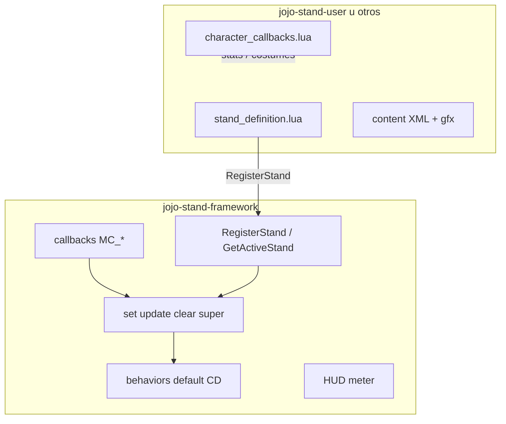

# JoJo Stand Mods — Documento del proyecto

Documento vivo con la visión, infraestructura y convenciones del monorepo.  
Para instalación rápida ver [README.md](../README.md).

---

## Idea del proyecto

Mod de *The Binding of Isaac: Repentance* inspirado en **JoJo's Bizarre Adventure**.

### Origen

- Base original: mod de **Josuke + Crazy Diamond** (melon / NotYourSagittarius).
- Extensiones previas del autor: variantes con **Jotaro / Star Platinum** y **Kakyoin / Hierophant Green**.
- El código original era monolítico y difícil de extender; este repo es la reescritura hacia un **estándar compartido**.

### Visión: “comunión” entre mods JoJo

La meta no es un solo mod gigante, sino un **ecosistema de mods compatibles**:

| Concepto | Descripción |
|----------|-------------|
| **Framework compartido** | Combate, meter, discos, save/load, API común |
| **Un mod por stand/personaje** | Assets + definición + lógica propia cuando haga falta |
| **Interacción cross-mod** | Mecánicas que afecten a todos los stands registrados |

### Mecánicas futuras (roadmap)

- [ ] **Stand Arrow** — otorgar o evolucionar stands en personajes que no lo tengan
- [ ] **Discos de Stand** (estilo Whitesnake) — ítems que intercambian el stand activo
- [ ] **Sala especial** — tipo observatorio de Repentance; discos, flechas, eventos JoJo
- [ ] **Mods de personaje** — Josuke, Jotaro, Kakyoin como content mods separados
- [ ] **Sinergias entre stands** — hooks/eventos cuando conviven varios mods

---

## Estado actual

| Mod | ID | Estado |
|-----|-----|--------|
| `jojo-stand-framework/` | `Maxo13:JoJoStandFramework` | Implementado (API v1) |
| `jojo-stand-user/` | `Maxo13:JoJoStandUser` | Personaje genérico + stand base |

Comportamiento de combate por defecto: **punch flurry de Crazy Diamond** (`idle → rush → attack → return`).

**Dependencias:** solo API vanilla de Repentance. No requiere Repentogon ni otros extenders.

---

## Infraestructura del repo

### Monorepo

```
isaac-stand-user-mod/          ← repo (contenedor, NO es un mod de Isaac)
├── docs/
│   └── PROJECT.md             ← este archivo
├── jojo-stand-framework/      ← mod instalable
├── jojo-stand-user/           ← mod instalable
├── install-mods.ps1           ← crea junctions en mods/
├── README.md
└── credit.txt
```

Isaac solo carga carpetas **directas** dentro de `mods/`. Por eso cada mod vive en subcarpeta y se expone con junction:

```powershell
.\install-mods.ps1
# mods/jojo-stand-framework  →  repo/jojo-stand-framework
# mods/jojo-stand-user        →  repo/jojo-stand-user
```

### Orden de carga

El content mod **depende** del framework:

1. `jojo-stand-framework` debe cargar primero (el prefijo alfabético ayuda).
2. `jojo-stand-user` llama a `JSF:RegisterStand(...)` al iniciar.

Si el framework no está presente, el content mod aborta con mensaje en consola.

### Entorno de prueba aislado (idea)

Isaac no tiene perfiles de mods. Opciones:

1. Activar solo framework + stand-user en el launcher.
2. Carpeta `mods-test/` con solo esos mods y script de swap (pendiente).
3. Seed fija para pruebas repetibles.

---

## Arquitectura



### Responsabilidades

| Capa | Framework | Content mod (ej. stand-user) |
|------|-----------|------------------------------|
| Callbacks del juego | Sí | Solo personaje (stats, costume) |
| FSM combate default | Sí | No (salvo `behaviorModule`) |
| Meter / HUD | Sí | Sprites propios opcionales |
| Save/load (`playerData.JSF`) | Sí | No |
| Swap de discos | Sí | Define el ítem disco |
| Personaje + XML | No | Sí |
| Sprites del stand | No | Sí |
| Super / hooks específicos | Infraestructura | Implementación en hooks |

### Datos del jugador

Namespace único para evitar colisiones entre mods:

```lua
playerData.JSF = {
    activeStandId = "generic_stand",
    activeDiscItem = CollectibleType.X,
    standEntity = Entity,      -- familiar spawneado
    standState = {             -- SuperCharge, SuperDuration, ...
    },
}
```

---

## API v1 — `_G.JoJoStandFramework`

Expuesta al cargar el framework. Versión: `JSF.API_VERSION = 1`.

| Método | Uso |
|--------|-----|
| `RegisterStand(def)` | Registra un stand (content mods) |
| `GetStand(id)` | Definición por id |
| `GetActiveStand(player)` | Stand activo según disco en inventario |
| `GetActiveStandId(player)` | Id del stand activo |
| `IsRegisteredDisc(collectibleId)` | ¿Es un disco registrado? |
| `GetPlayerData(player)` | Tabla `playerData.JSF` |
| `SetActiveStand(player, standId)` | Asignar stand |
| `SwapStandDisc(player, discItemId)` | Cambiar disco (deja el anterior en pedestal). Disparado vía `MC_PRE_PICKUP_COLLISION` al tocar un pickup de disco |
| `EnsureLinkedStandDisc(player)` | Auto-disco si el personaje está en `linkedCharacters` |
| `GetAllStandDefs()` | Lista de stands registrados |

### Schema de `stand_definition.lua`

Ver ejemplo completo en [`jojo-stand-user/stand_definition.lua`](../jojo-stand-user/stand_definition.lua).

Campos principales:

```lua
{
    id = "generic_stand",
    discItem = Isaac.GetItemIdByName("Stand"),
    familiarVariant = 13000,
    particleVariant = 13001,
    floatOffset = Vector(0, -36),
    animations = { spIdle = {...}, spMad = {...}, ... },
    stats = { ChargeLength = 7, Punches = 5, ... },
    sounds = { punchlight = ..., ... },
    behaviorModule = nil,       -- nil = default CD del framework
    hooks = {
        getMaxPunches = function(player, standDef) ... end,
        getFinisherDamageMult = function(player, standDef) ... end,
        onSuperStart = function(player, standEntity, standDef) ... end,
        onSuperFinish = function(player, standEntity, standDef) ... end,
    },
    linkedCharacters = { Isaac.GetPlayerTypeByName("StandUser") },
}
```

---

## Convenciones

### Variant IDs de entidades

Reservar pares consecutivos por stand:

| Stand | Familiar | Partícula |
|-------|----------|-----------|
| `generic_stand` | 13000 | 13001 |
| *(próximo)* | 13002 | 13003 |
| *(próximo)* | 13004 | 13005 |

Fórmula sugerida: `13000 + 2*n` (familiar) y `+ 1` (partícula).

### Behaviors

**No hay presets** (`melee`, `ranged`, etc.).

- El framework incluye **un solo default**: punch flurry CD.
- Stands futuros con combate distinto:
  - `behaviorModule` propio, **o**
  - copiar/adaptar los behaviors del framework dentro de su mod.

### Nombres de ítems

Usar nombres únicos por stand: `"Star Platinum Disc"`, no `"Stand"` genérico (salvo el stand base de prueba).

### Mod IDs

| Mod | RegisterMod |
|-----|-------------|
| Framework | `Maxo13:JoJoStandFramework` |
| Stand User | `Maxo13:JoJoStandUser` |
| Futuros | `Maxo13:JoJo_<Nombre>` |

---

## Crear un mod de stand nuevo

1. Copiar estructura de `jojo-stand-user/` como plantilla.
2. Reservar variant IDs en la tabla de arriba.
3. Definir `stand_definition.lua` + assets (`content/`, `resources/gfx/`).
4. En `main.lua`:

```lua
local JSF = _G.JoJoStandFramework
if not JSF then return end
JSF:RegisterStand(require("stand_definition"))
```

5. Agregar junction en `install-mods.ps1` o carpeta `mods-test/`.
6. Probar con framework + nuevo mod activos.

---

## Checklist de prueba manual

- [ ] Solo framework activo → no crashea (sin stands registrados no hay gameplay visible)
- [ ] Framework + stand-user → personaje StandUser con disco y familiar
- [ ] Combate: carga → rush → punch flurry
- [ ] Super: meter carga y activa con tecla configurada (`C` / L3)
- [ ] Cambio de sala: fade del stand + persistencia de meter
- [ ] Coop 2 jugadores
- [ ] Swap de disco (cuando haya más de un stand registrado)

---

## Deuda técnica / notas

- Puede quedar código legacy en la raíz del repo (`src/`, `content/` del mod viejo). No debe cargarse como mod; conviene limpiarlo.
- Tainted StandUser comentado en `players.xml`; hooks ya preparados en `stand_definition.lua`.
- Sonidos referenciados en `sounds.xml`; verificar que los `.wav` estén en `content/sounds/stand_user/`.
- Swap de discos usa `MC_PRE_PICKUP_COLLISION` (vanilla). El disco anterior se suelta en el pedestal vacío más cercano o en el suelo.

---

## Créditos

| Rol | Persona |
|-----|---------|
| Diseño / código original (CD) | melon |
| Arte original | NotYourSagittarius |
| API / refactor framework | Maxo13 |

Ver [credit.txt](../credit.txt).

---

## Changelog del documento

| Fecha | Notas |
|-------|-------|
| 2026-07-05 | Split framework + stand-user; API v1; este documento inicial |
| 2026-07-05 | Swap de discos migrado a `MC_PRE_PICKUP_COLLISION`; sin dependencia de Repentogon |
